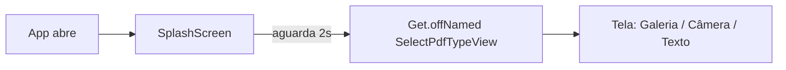
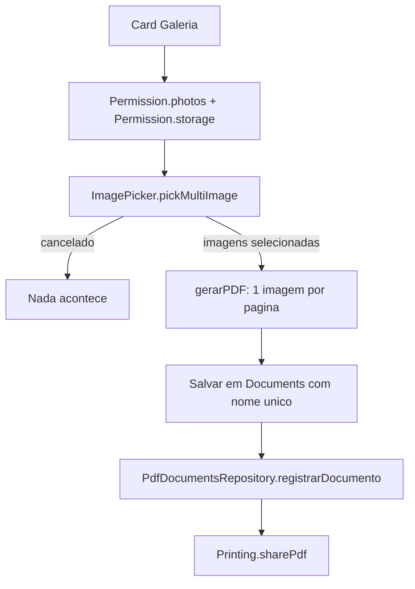
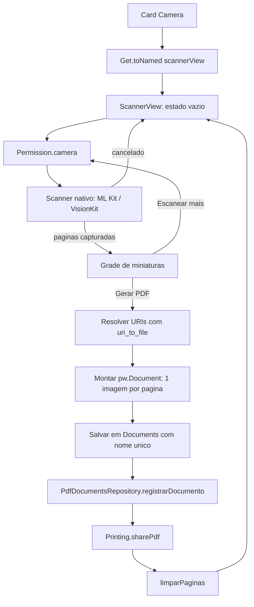
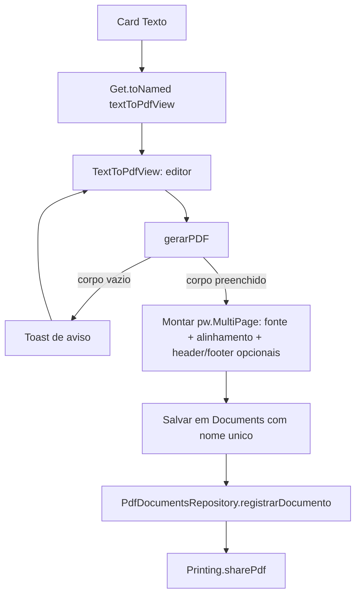
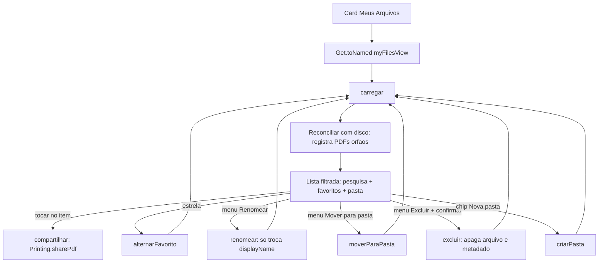
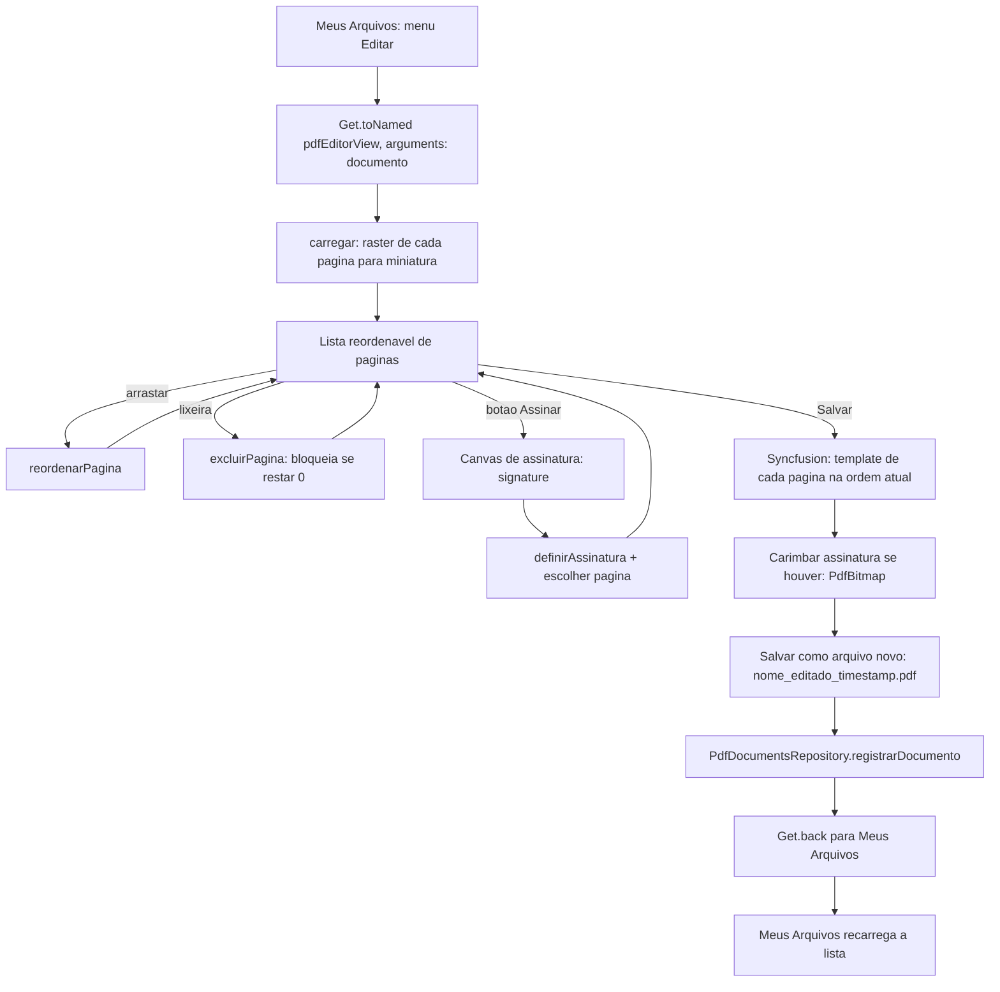

# Fluxos

## Splash → Seleção de tipo

`SplashScreen` mostra o ícone do app, um `CircularProgressIndicator` e o texto "PDF Generator". Após 2 segundos (`Future.delayed`), navega com `Get.offNamed` (substitui a rota, sem permitir voltar para a splash).

## Foto (galeria) → PDF

Implementado em [SelectPdfTypeContoller](../lib/src/pages/select_PDF_type/controller/select_PDF_type_contoller.dart).

## Scanner (câmera) → PDF

Implementado em [ScannerController](../lib/src/pages/scanner/controller/scanner_controller.dart) + [ScannerView](../lib/src/pages/scanner/view/scanner_view.dart). A detecção de bordas, correção de perspectiva, corte, rotação e filtros acontecem inteiramente dentro da UI nativa do scanner (ML Kit/VisionKit) — o app Flutter só recebe as imagens já processadas.

## Texto → PDF

Implementado em [TextToPdfController](../lib/src/pages/text_to_pdf/controller/text_to_pdf_controller.dart) + [TextToPdfView](../lib/src/pages/text_to_pdf/view/text_to_pdf_view.dart). Reaproveita [CustomTextField](../lib/src/components/custom_text_field.dart) (corpo multilinha + cabeçalho/rodapé de uma linha) e os enums [PdfFontOption](../lib/src/enum/pdf_font_option.dart)/[PdfTextAlignOption](../lib/src/enum/pdf_text_align_option.dart) para mapear a escolha do usuário para `pw.Font`/`pw.TextAlign`.

## Meus Arquivos

Implementado em [MyFilesController](../lib/src/pages/my_files/controller/my_files_controller.dart) + [MyFilesView](../lib/src/pages/my_files/view/my_files_view.dart), sobre o [PdfDocumentsRepository](../lib/src/repositories/pdf_documents_repository.dart). Toda ação que muda dados (renomear, excluir, favoritar, mover, criar/excluir pasta) recarrega a lista do zero (`carregar()`) em vez de tentar sincronizar o estado local manualmente — mais simples e sem risco de a UI dessincronizar do que está salvo no Hive.

## Editor de PDF

Implementado em [PdfEditorController](../lib/src/pages/pdf_editor/controller/pdf_editor_controller.dart) + [PdfEditorView](../lib/src/pages/pdf_editor/view/pdf_editor_view.dart). Único controller do projeto registrado via `binding`/`Get.lazyPut` em vez de `Get.put` em `main()` (ver [02-arquitetura.md](02-arquitetura.md)), porque precisa saber qual documento está sendo editado a cada navegação. A manipulação real do PDF usa `syncfusion_flutter_pdf` sobre os bytes originais (preserva qualidade); `Printing.raster` (já usado no app) só gera as miniaturas de pré-visualização.

## Compartilhamento

Comum a Foto→PDF, Scanner→PDF, Texto→PDF e Meus Arquivos: `Printing.sharePdf(bytes: ..., filename: ...)`, que abre a folha de compartilhamento nativa do sistema operacional (não há upload para nuvem nem envio automático por e-mail). Em Meus Arquivos, os bytes são lidos de volta do arquivo salvo (`path`) em vez de vir direto da geração do PDF. O Editor de PDF não compartilha automaticamente ao salvar — o PDF editado fica disponível em Meus Arquivos, de onde pode ser compartilhado como qualquer outro documento.
